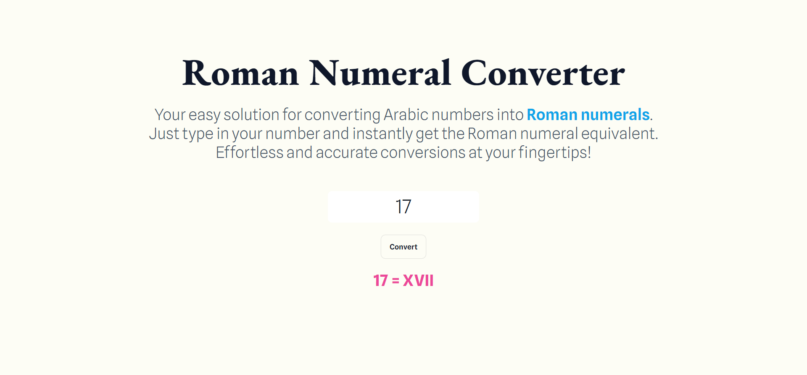

# Roman Numeral Converter

Welcome to the Roman Numeral Converter project! This simple webpage allows users to convert Arabic (decimal) numbers to Roman numerals. You can try out the live version of the project [here](https://roman-numeral-converter-nu.vercel.app/).

## Table of Contents

- [Introduction](#introduction)
- [Features](#features)
- [Technologies Used](#technologies-used)
- [Usage](#usage)
- [License](#license)

## Introduction

The Roman Numeral Converter is a user-friendly tool that provides an easy way to convert Arabic numbers into their corresponding Roman numeral representations. It's a handy educational resource for understanding the Roman numeral system while also practicing basic web development skills.

## Features

- Convert Arabic (decimal) numbers to Roman numerals.
- Interactive and intuitive user interface.
- Modern and responsive design.

## Technologies Used

The project is developed using the following technologies:

- HTML
- CSS
- [Tailwind CSS](https://tailwindcss.com/)
- JavaScript

## Usage

1. Open the [Roman Numeral Converter](https://roman-numeral-converter-nu.vercel.app/) in your web browser.
2. Enter an Arabic (decimal) number that you wish to convert.
3. When you type and hit enter, the corresponding Roman numeral will be dynamically displayed.

## License

This project is licensed under the [MIT License](LICENSE).
